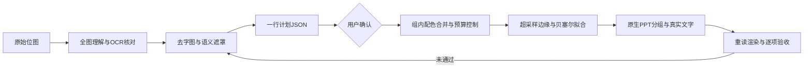

# PPP — Pixel to PPT Path


把科研机制图重建为 PowerPoint **原生分组、可编辑路径和真实文字**。先理解、后描摹；忽略背景，图形总数最多 1000。PPP 原名 GaphicAI。

## 特性

- 四角背景洪填与语义遮罩保护，保留浅色主体。
- 先输出一行计划 JSON；用户确认后才生成完整矢量。输入改变使计划失效。
- 2–4 倍边缘场分析、0.5 px 简化与坐标吸附、三次贝塞尔几何。
- 原生 PPT 组；组内图形递归计数，引用不会绕过 1000 上限。
- 组级颜色表、默认色、重复几何定义及 `ref`/`at` 实例。
- 保存后重读渲染、400% 预览及独立预算审计。

**边界**：本项目需要 Windows、PowerShell 和 Codex 提供的工作区运行时。Python 图像计算本地运行，语义理解仍由模型完成；它不是全离线模型。不能保证任意图像的完美语义分割或像素一致。400% 无连续同向台阶是验收要求，几何检查通过不代表整张渲染图通过。

## 实现原理

PPP 是一套 **Skill 指令 + 本地计算工具 + 验收流程**，不是独立训练的图像生成模型。它将“理解图片”和“计算几何”分开：代理负责识别实体、核对文字、箭头与遮挡，Python/Node 工具负责确定性的转换和检查。



| 阶段 | 实际做法 | 需要核对的内容 |
| --- | --- | --- |
| 理解与文字 | RapidOCR 提取候选，代理修正文字及坐标；OpenCV 根据已核对的文字区域生成去字候选 | OCR 可能误读，去字可能损伤细线 |
| 语义与背景 | 代理准备互斥 mask；工具结合背景颜色模型和四角连通区域识别背景，mask 保护主体 | mask 不是自动可靠的细胞分割；未归属像素不能当作已处理 |
| 配色与预算 | 组内 CIELAB 聚类，相邻 RGB 各通道差小于20的颜色合并；按预算逐级吸收小色层 | 保留大主体和受保护单元；不足以保留主体时拒绝，而非删图凑数 |
| 边缘 | 色块边缘场放大2–4倍并平滑，再简化轮廓、生成直线/三次贝塞尔，吸附0.5px网格 | 插值不能恢复不存在的细节；需检查尖角、孔洞、接缝与边缘偏移 |
| 几何复用 | 同组颜色放入颜色表；平移后完全相同的几何共享定义，实例用 `ref` 与 `at` 表示 | 仅精确复用，不把外观不同的细胞强行统一 |
| PPT 导出 | 写入 DrawingML 原生 `p:grpSp`、`p:sp` 和 `a:cubicBezTo`，从文字模板保留真实文本框 | 箭头可编辑，但不是随节点移动自动重连的连接器 |
| 验收 | 独立复算对象数、重读保存的PPT、输出400%预览与误差数据 | 预算通过、结构通过、机制正确和视觉通过是不同结论 |

多色单元可以增加一个同主体轮廓的主色形状覆盖内部抗锯齿细缝；该形状也计入1000预算。每个组内同色区域可组成复合路径，因此报告同时列出图形、组、子路径和节点数量。文字不转成轮廓，单独计数。

## 快速开始

```bash
git clone https://github.com/wangzining-1/PPP.git
cd PPP
```

在 Codex 中取得工作区依赖路径（`load_workspace_dependencies`），然后在 PowerShell 执行：

```powershell
.\ppp\scripts\setup.ps1 `
  -PythonExecutable '<bundled python.exe 的绝对路径>' `
  -NodeExecutable '<bundled node.exe 的绝对路径>' `
  -NodeModules '<bundled node_modules 的绝对路径>' `
  -PresentationSkillDirectory '<Presentations skill 的绝对路径>'
```

安装器建立独立 venv、安装固定版本依赖、部署 `ppp` 技能并运行诊断。`@oai/artifact-tool`、Codex、Office 不包含在 本项目发布包中，不能通过普通 `npm install` 推定获得这些宿主组件。首次安装需要联网下载 Python 依赖；图片不会上传至第三方矢量化服务。

Python 图像/OCR依赖由 [requirements.lock](ppp/requirements.lock) 固定版本。安装器写入本机专用的 `runtime.local.json`，记录 Python、Node、模块及 Presentations 验证器路径；该文件不入库，也不应从他人机器复制。目标机器必须已具备上述宿主组件，单纯克隆仓库不能替代这些前置条件。

默认安装位置为 `$CODEX_HOME/skills/ppp`（未设置时使用用户目录下 `.codex/skills/ppp`）；运行时默认位于用户目录 `.local/share/ppp`。可通过安装参数 `-SkillsDirectory`、`-RuntimeDirectory` 自定义。安装后在新会话中调用 `$ppp`，或先运行：

```powershell
$skillsRoot = if ($env:CODEX_HOME) { Join-Path $env:CODEX_HOME 'skills' } else { Join-Path $env:USERPROFILE '.codex/skills' }
$runner = Join-Path $skillsRoot 'ppp/scripts/run.ps1'
& $runner doctor
```

## 使用示例

```text
使用 $ppp 将附件机制图重建为可编辑 PPT。先只给一行计划 JSON，
我确认后再生成；忽略背景，图形≤1000，按400%边缘标准逐项验收。
```

先由代理阅读原图、核对 OCR，生成去字图和经审查的互斥语义遮罩。配置见 [预算流程](ppp/references/budget-vectorization.md)。命令中的路径均为示例：

```powershell
# $runner 使用上一步设置的安装入口。
& $runner budget plan graphics.png semantic.json
# 输出一行 {"plan":"...","units":...,"max_shapes":1000,"ss":3,"grid":0.5,"status":"awaiting_confirmation"}
# 等用户确认这份计划，再使用该 plan 标识。CLI 参数是调用者的确认声明，不是身份认证。
& $runner budget build graphics.png semantic.json work/budget --confirm-plan '<plan 标识>'
& $runner budget pptx text-template.pptx work/budget work/candidate.pptx
& $runner budget audit work/candidate.pptx
& $runner render work/candidate.pptx work/preview.png --scale 4
& $runner finalize '<工作区绝对路径>' '<候选绝对路径>' '<新的最终PPT绝对路径>'
```

`text-template.pptx` 必须是同尺寸单页原生 PPT，文字为顶层未填充文本框。可使用 `export` 从仅含已核对文字的 scene 生成。不要嵌入原图作为替代输出。所有输出使用新路径。

## 配置一个转换任务

准备以下文件：

```text
task/
├── graphics.png          # 已核对去字结果
├── semantic.json         # 图像尺寸、语义单元、背景配置
├── masks/
│   ├── cell-01.png       # 同尺寸灰度mask
│   └── arrow-01.png
└── text-template.pptx    # 同尺寸、单页、真实文字模板
```

`semantic.json` 示例（尺寸应替换为实际图片尺寸）：

```json
{
  "width": 700,
  "height": 678,
  "supersample": 3,
  "background_tolerance": 18,
  "background_seeds": [[0, 0], [699, 0], [0, 677], [699, 677]],
  "units": [
    {"id": "cell-01", "mask": "masks/cell-01.png", "colors": 6, "protected": false},
    {"id": "arrow-01", "mask": "masks/arrow-01.png", "colors": 3, "protected": true}
  ]
}
```

mask 中灰度大于127的像素属于该单元；所有mask必须同尺寸、互斥，文件路径相对于配置目录。背景复杂时增加 `"background_model": "background-model.png"`，提供同尺寸RGB模型。角点被主体占据时调整背景种子并检查结果，不能让洪填吞掉浅色主体。

文字 scene 的完整字段说明见 [scene schema](ppp/references/scene-schema.md)。只含文字的模板应设置 `"background":"none"`，通过以下命令创建：

```powershell
& $runner export labels.scene.json text-template.pptx text-template.svg
```

`build` 输出 `graphics.svg`、紧凑的 `groups.json`、`budget.json`、`background-mask.png` 和 `foreground-mask.png`。SVG仅含图形，PPT导出时再从模板加入文字。`budget.json` 中的 `unassigned_pixels`、`staircase_candidates` 和 `edge_400_percent` 是验收依据，不能忽略待处理状态。

## 可调参数

| 参数 | 默认 | 范围与含义 |
| --- | --- | --- |
| `--max-shapes` | 1000 | 1–1000；按展开后的图形路径计数 |
| `supersample` | 3 | `semantic.json` 中 2、3 或 4 |
| `background_tolerance` | 18 | 背景模型的最大 RGB 通道偏差 |
| `background_model` | 四角插值 | 可指定同尺寸 RGB PNG 模型 |
| `background_seeds` | 四角 | 仅使用真实背景入口 |
| `units[].colors` | 6 | 起始组内调色板大小，最多32 |
| `units[].protected` | false | 禁止预算强制削减该组颜色 |
| 坐标网格 | 0.5 px | 固定；输出最多1位小数 |
| `render --scale` | 1 | 1、2、3、4；400%验收用4 |

配色当前使用主色块近似，不承诺原生渐变拟合。抗锯齿同色接缝补偿使用 1 px 轮廓，主体边缘最多向外延伸 0.5 px；必须结合语义、前景误差和400%渲染复核，不能仅凭元素少判定合格。

## 目录结构

```text
PPP/
├── README.md
├── LICENSE
├── ppp/
│   ├── SKILL.md
│   ├── agents/openai.yaml
│   ├── requirements.lock
│   ├── references/
│   └── scripts/
└── tests/
```

## 测试与验收

```powershell
& '<PPP venv python.exe>' -m unittest discover -s tests -p 'test_*.py' -v
```

测试覆盖背景、预算、遮罩、细线、原生组/文字、贝塞尔/网格、复用引用与拒绝超预算展开。最终还必须查看保存后渲染、未归属前景和全部机制关系。`edge_400_percent: pending` 不能写成验收通过。PowerPoint 桌面编辑只有实际执行后才能标为验证。

v3.0发布前运行了34项测试，并用自建小图验证了原生PPT导出、400%渲染及封装检查。这不是任意科研机制图的性能基准。以下情况需修复或明确报告，不能自动标为成功：

- 预算无法同时保住全部语义单元；遮罩遗漏或重叠。
- 半透明像素：当前预算工具明确拒绝；完全透明像素可以跳过。
- 复杂渐变、真实阴影、模糊低清轮廓和字体替换导致的差异。
- 400%下仍有两级以上同向台阶，或仅检查了部分边缘。

大段几何保存在磁盘，通过颜色表和引用减少重复存储；不承诺未经测量的模型token节省比例。

## 发布到 GitHub

维护现有仓库时，先确认暂存区不含运行配置、用户原图、输出或凭据：

```bash
git add README.md LICENSE .gitignore .gitattributes ppp tests
git diff --cached --stat
git commit -m "PPP v3.0"
git push -u origin main
```

提交需要本机 Git 身份与 GitHub 认证。目标仓库为 `wangzining-1/PPP`；已有 `origin` 时先核对，不能覆盖未知远端。

## License

[GNU GPL-3.0](LICENSE)。第三方依赖及宿主应用各自遵循其许可证。
